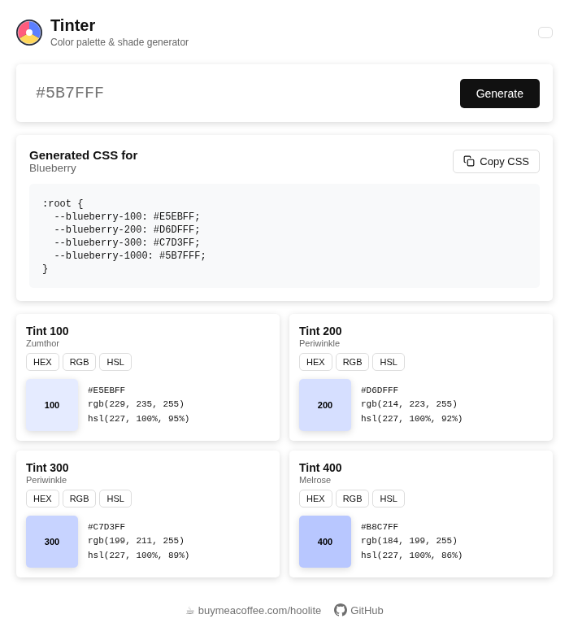
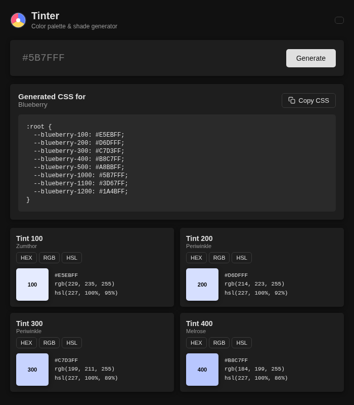

# Tinter — Color Palette Generator

A browser extension for Chrome that generates color tints, shades,
and CSS variables from any hex color. No account needed, works offline
(except for color name lookup).

## Features

- 20 variants per color: 10 lighter (100–1000) and 10 darker (1100–2000)
- Color harmonies: complementary, analogous, triadic
- Copy individual colors in HEX, RGB, or HSL
- Copy ready-to-use CSS custom properties (variables)
- Color names via the Color API
- Dark / light / system theme

## Screenshots

| Light | Dark |
|-------|------|
|  |  |

## How to install (developer mode)

The extension is not listed in the Chrome Web Store. You can install it
manually in a few steps:

1. Download this repository — click **Code → Download ZIP** and unzip it
2. Open Chrome or Edge and go to `chrome://extensions`
3. Enable **Developer mode** (toggle in the top right)
4. Click **Load unpacked**
5. Select the `tinter-extension` folder

The Tinter icon will appear in your browser toolbar.

## Usage

1. Click the Tinter icon in your toolbar
2. Enter a hex color code (e.g. `#5B7FFF`)
3. Click **Generate**
4. Copy any color value or the full CSS block with one click

## Support

If you find Tinter useful:
[☕ Buy me a coffee](https://buymeacoffee.com/hoolite)
